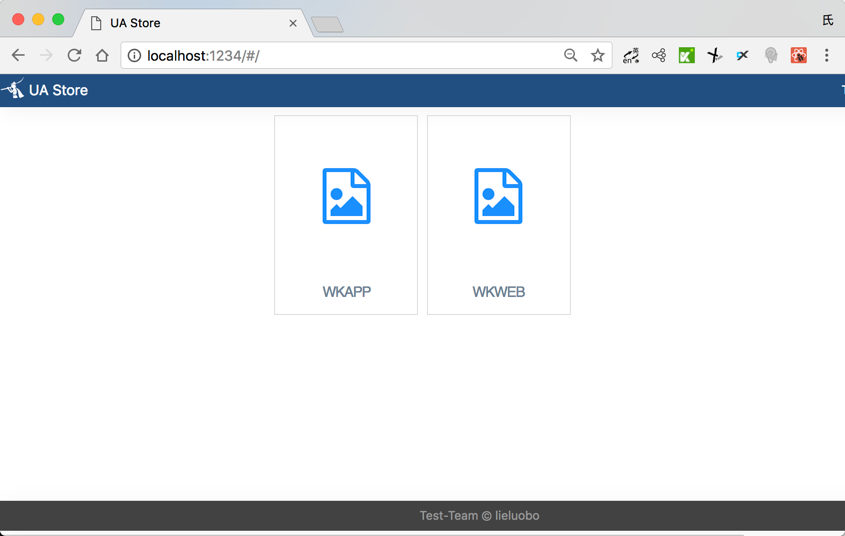
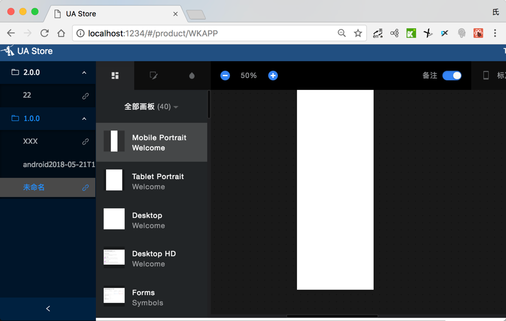
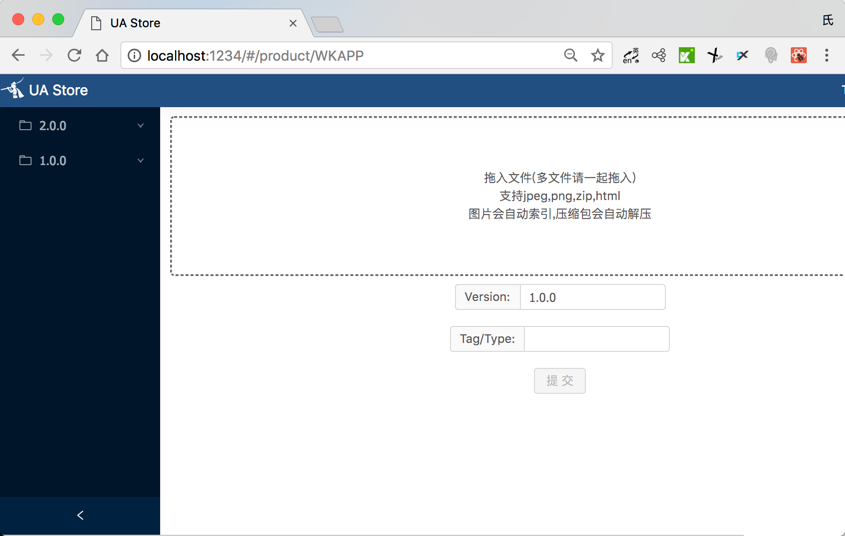

UED Store
===========


    src-server 后端代码
    src-client 前端代码
    
## preview 



quick start
=============

**Install dependencies:**

```sh
$ npm install
```

** build FE :**

```sh
$ npm build
```

**Run koa server:**

```sh
$ npm server
```
 
Open [http://localhost:3000](http://localhost:3000)

**Run the test:**

```sh
$ npm test
```

Components
==========

koa-starter uses following npm package : 

* `config` for config handling.
* `koa-router` for request routing purpose.
* `koa-static` for handling static content or assets.
* `koa-views` for template switching.
* `ect` for default templatin engine due to fast performance.

Resources
=========

* 注意:需要node 7
* [https://justmyfreak.com/koa-starter-a-koa-starting-template/](https://justmyfreak.com/koa-starter-a-koa-starting-template/)
